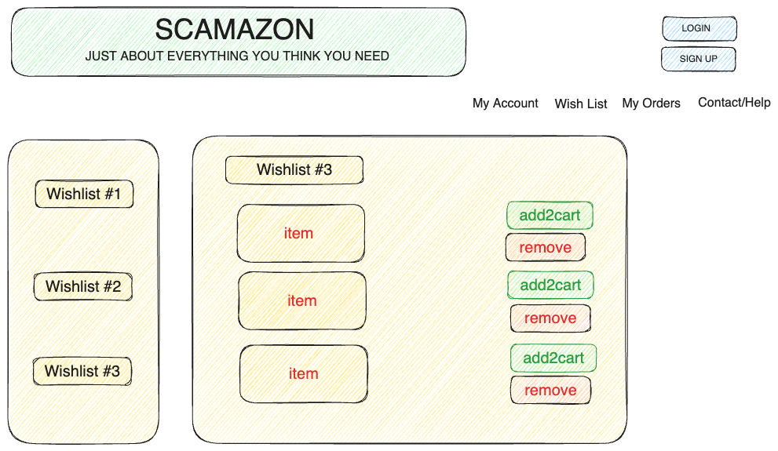
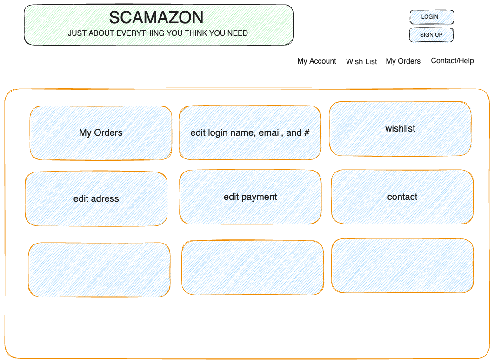

# SCAMAZON
### "Delivering imaginary solutions to your imaginary needs." - Scamazon CEO, Melon Husk

  
Table of Contents

  <ol>
    <li>
      <a href="#about-the-project">Contents</a>
      <ul>
        <li><a href="#Purpose">Purpose</a></li>
        <li><a href="#Meet-The-Team">Meet our team</a></li>
        <li><a href="#Portfolio">Portfolio</a></li>
        <li><a href="#Technologies_Used">Technologies Used</a></li>
        <li><a href="Routing">API/Routing</a></li>
        <li><a href="#App/Site_Features">Features</a></li>
        <li><a href="#Technical_Challenges">Challenges</a></li>
        <li><a href="#Collaborators">Collaborators</a></li>
      </ul>
    </li>
    <!-- <li>
      <a href="#placeholder">placeholder</a>
      <ul>
        <li><a href="#API">API</a></li>
        <li><a href="#placeholder">placeholder</a></li>
        <li><a href="#placeholder">placeholder</a></li>
      </ul>
    </li>
    <li><a href="#placeholder">placeholder</a></li>
    <li><a href="#placeholder">placeholder</a></li>
    <li><a href="#placeholder">placeholder</a></li> -->
  </ol>

<!-- * [Purpose] (#purpose)
* [Usage] (#usage)
* [Portfolio] (#portfolio)
<!-- * [Wireframes] (#wireframes) -->
<!-- * [ERD] (#ERD)
* [Trello_Board] (#trello-board) -->
<!-- * [Technologies_Used] (#technologies-used)
<!-- * [API] (#api) -->
<!-- * [API/Routing] (#api/routing)
* [Testing] (#testing)
* [App_Features]  (#app-features) /*(mentions the function names, type of function (if applicable(i.e. Callback, loop, closure)) what it does, type of request it sends (if applicable), or any other information)*/
* [Technical_Challenges] (#technical-challenges)
* [Collaborators] (#collaborators) --> 

### Purpose 

Our team created a MERN stack web application similar in style and function to multinational e-commerce platform, Amazon, for General Assembly coding bootcamp. 

### Usage

This is a basic e-commerce application using the MERN stack. Its main usage is to show the world our newfound programming skills. 

### Portfolio 

  
Portfolio

  
  ## Portfolio
  
  1. Wireframes 

  ##### Landing Page
  

  ##### Items List
  

  ##### Item Detail
  

  ##### Cart
  

  ##### My Orders
  

  ##### Wishlist
  

  ##### Checkout
  

  ##### Login/Sign Up
  
  

  ##### My Account
  

  ##### Contact
  

  #### Misc
  
  
  
  
  
  
  

  
  
  2. ERD 

  3. Trello
      https://trello.com/b/9bIYwNbL/scamazon
      

<!-- ### Wireframes

#### Landing Page

#### Items List

#### Item Detail

#### Cart

#### My Orders
 

#### Wishlist

#### Checkout

#### Login/Sign Up

#### My Account

#### Contact

#### Misc

 -->

### Technologies_Used

|         |         | List    |         |         |
| ------- | ------- | ------- | ------- | ------- |
| [![React][React.js]][React-url] | [![Nodejs][Node.js]][Node-url] | [![Express][Express]][Express-url] | [![Postman][Postman]][Postman-url] | [![Mongodb][Mongodb]][Mongodb-url] |
| [![Slack][Slack]][Slack-url] | [![Vscode][Vscode]][Vscode-url] | [![Github][Github]][Github-url] | [![Trello][Trello]][Trello-url] | [![BootStrap][BootStrap]][BootStrap-url] |
| [![JWT][JWT]][JWT-url] | [![DigitalOcean][DigitalOcean]][DigitalOcean-url] | [![Gulp][Gulp]][Gulp-url] | [![Babel][Babel]][Babel-url] | [![Nodemon][Nodemon]][Nodemon-url] |
| [![Webpack][Webpack]][Webpack-url] | [![DigitalOcean][DigitalOcean]][DigitalOcean-url] | [![Gulp][Gulp]][Gulp-url] | [![Babel][Babel]][Babel-url] | [![Nodemon][Nodemon]][Nodemon-url] |

  
API

- USER ROUTES

| **HTTP Method** | **End Point**    |    **Action**     |
| :-------------- | :--------------: | ----------------: |
| POST            | /user            | Creates user      |
| POST            | /user/login      | Logs in user      |
| POST            | /user/logout/:id | Logs out user     |
| DELETE          | /user/:id        | Delete user       |
| PUT             | /user/:id        | Update user       |
| GET             | /user/:id        | Get user info     |

- ORDER ROUTES

| **HTTP Method** | **End Point**    |    **Action**     |
| :-------------- | :--------------: | ----------------: |
| GET             | /orders/cart            | get cart info       |
| GET             | /orders/history         | orders history      |
| POST            | /orders/cart/items/:id  | add item to cart    |
| POST            | /orders/checkout        | checkout cart       |

- ITEMS ROUTES

| **HTTP Method** | **End Point**    |    **Action**     |
| :-------------- | :--------------: | ----------------: |
| GET             | /items           | get items info    |
| GET             | /items/:id       | get one item info |

-  ITEM ROUTES

| **HTTP Method** | **End Point**    |    **Action**     |
| :-------------- | :--------------: | ----------------: |
| GET            | /                 | Get items         |
| GET            | /:id              |Gets one item by id| 

- ORDER ROUTES

| **HTTP Method** | **End Point**    |    **Action**              |
| :-------------- | :--------------: | --------------------------:|
| GET             | /cart            | Gets the cart              |
| GET             | /history         | Gets order history         |
| POST            | /cart/items/:id  | Adds to cart               |
| POST            | /cart/checkout   | Checkout cart              |
| PUT             | /cart/qty        | Sets item quantity in cart |

- WISHLIST ROUTES

| **HTTP Method** | **End Point**    |    **Action**         |
| :-------------- | :--------------: | ---------------------:|
| GET             | /                | Gets the wish list    |
| POST            | /:id             | Adds to wish list     |
| DELETE          | /:id             | Delete from wish list |

### Testing

### App/Site Features 

- Wish List 
  `Our wishlist uses MERN stack technology to target items by their id number and add them to an array to be rendered as list. In general, this practice is used by professionals in the industry. Over time, this type of feature has been adopted by several e-commerce companies.` 
- Cart/Checkout 
  `Our Cart and Checkout features work hand-in-hand to deliver optimal and speedy services to our customers. We believe users time is more precious than ever, so we understand the importance of streamlined frontend with a solid backend to support the needs of everybody.`

- Rating Component 
  `We get a rating component on the frontend on a scale of 1 to 5 stars to enhance UX. Rating items allows users to contribute to our little community of shoppers with honest feedback on our products.`
- Carousel 
  `We used Bootstrap to make an item carousel on the home page. Carousels are commonly used in frontend development to add animation and interactivity to a page. Animation caters to peoples' short attention spans by allowing users to browse seemlessly through a set of items as soon as they get onto our website. This tricks the users into a feeling of control: they want to browse for items, and they once they go to our site, they get instant gratification.`
- Category Bar
  `Our category bar enables users to quckly and seamlessly navigate through each category of items. This is useful for people in need of several items for specfic purposes.`

### Technical_Challenges

   #### Installing Vite 

### Collaborators 

  

<!--Links For Stuff-->

[React.js]: https://img.shields.io/badge/React-20232A?style=for-the-badge&logo=react&logoColor=61DAFB

[React-url]: https://reactjs.org/

[Node.js]: https://img.shields.io/badge/Node.js-43853D?style=for-the-badge&logo=node.js&logoColor=white

[Node-url]: https://nodejs.org/en/

[Express]: https://img.shields.io/badge/Express.js-404D59?style=for-the-badge

[Express-url]: https://expressjs.com/

[Postman]: https://img.shields.io/badge/Postman-FF6C37?style=for-the-badge&logo=postman&logoColor=white

[Postman-url]: https://www.postman.com/

[Mongodb]: https://img.shields.io/badge/MongoDB-%234ea94b.svg?style=for-the-badge&logo=mongodb&logoColor=white

[Mongodb-url]: https://www.mongodb.com/

[Slack]: https://img.shields.io/badge/Slack-4A154B?style=for-the-badge&logo=slack&logoColor=white

[Slack-url]: https://slack.com/

[Vscode]: https://img.shields.io/badge/Visual%20Studio%20Code-0078d7.svg?style=for-the-badge&logo=visual-studio-code&logoColor=white

[Vscode-url]: https://code.visualstudio.com/

[Github]: https://img.shields.io/badge/github-%23121011.svg?style=for-the-badge&logo=github&logoColor=white

[Github-url]: https://github.com/

[Trello]: https://img.shields.io/badge/Trello-%23026AA7.svg?style=for-the-badge&logo=Trello&logoColor=white

[Trello-url]: https://trello.com/

[Bootstrap]: https://img.shields.io/badge/bootstrap-%238511FA.svg?style=for-the-badge&logo=bootstrap&logoColor=white

[Bootstrap-url]:https://getbootstrap.com/

[JWT]: https://img.shields.io/badge/JWT-black?style=for-the-badge&logo=JSON%20web%20tokens

[JWT-url]: https://jwt.io/

[DigitalOcean]: https://img.shields.io/badge/DigitalOcean-%230167ff.svg?style=for-the-badge&logo=digitalOcean&logoColor=white

[DigitalOcean-url]: https://www.digitalocean.com/

[Gulp]: https://img.shields.io/badge/GULP-%23CF4647.svg?style=for-the-badge&logo=gulp&logoColor=white

[Gulp-url]: https://gulpjs.com/

[Babel]: https://img.shields.io/badge/Babel-F9DC3e?style=for-the-badge&logo=babel&logoColor=black

[Babel-url]: https://babeljs.io/

[Nodemon]: https://img.shields.io/badge/NODEMON-%23323330.svg?style=for-the-badge&logo=nodemon&logoColor=%BBDEAD

[Nodemon-url]: https://nodemon.io/

[Webpack]: https://img.shields.io/badge/webpack-%238DD6F9.svg?style=for-the-badge&logo=webpack&logoColor=black

[Webpack-url]: https://webpack.js.org/

